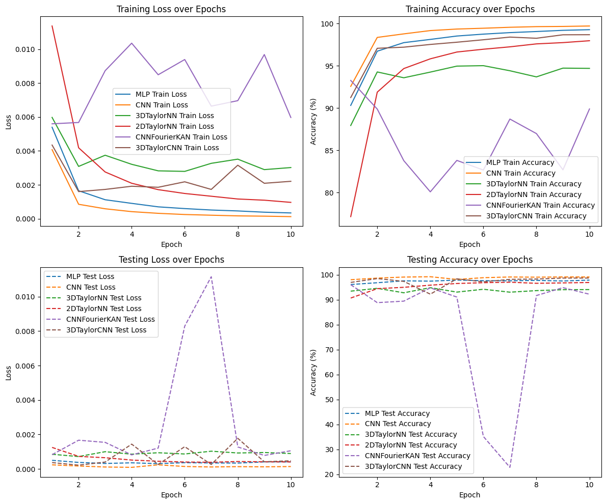
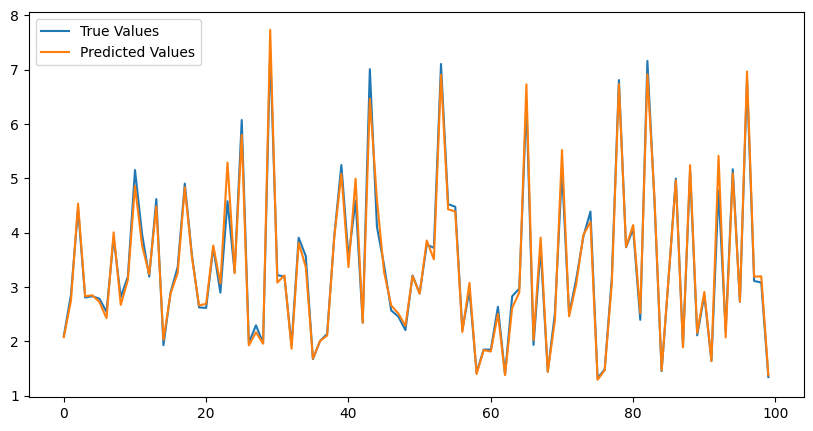
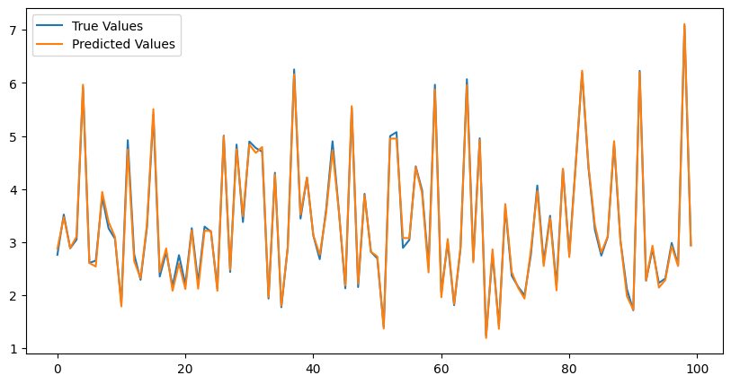
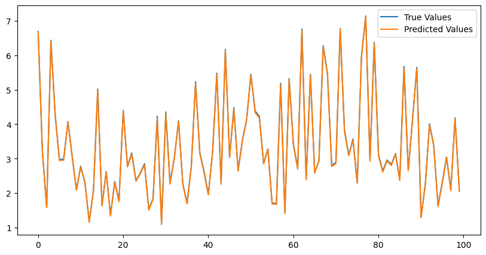
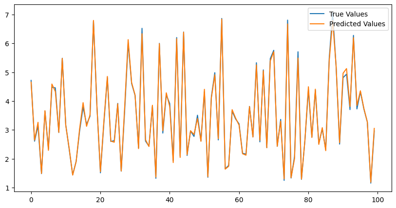
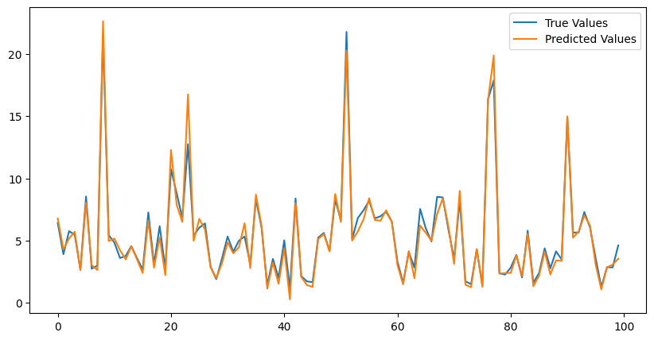
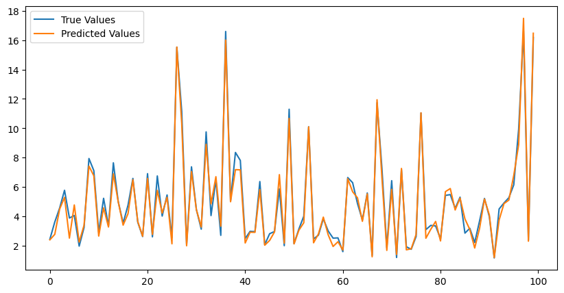
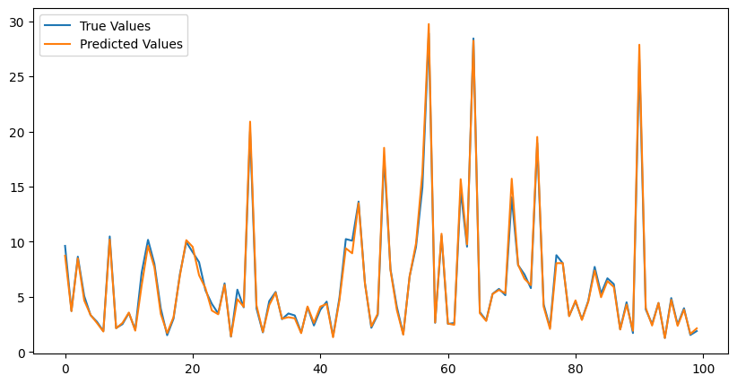
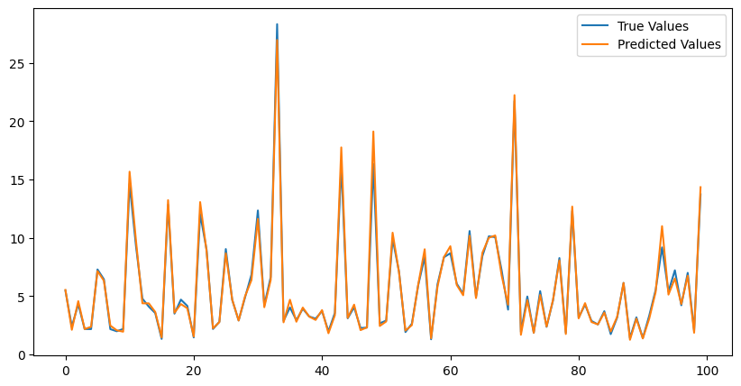

# TaylorKAN

Inspired by FourierKAN, we attempted to use Taylor series expansion to accomplish tasks on the MNIST dataset.
This code only accomplishes a small task, we are working on trying more complex tasks and continuously optimizing the Taylor method.
## References

This project is inspired by the FourierKAN in the following repositories:
- [FourierKAN](https://github.com/GistNoesis/FourierKAN) - This is inspired by Kolmogorov-Arnold Networks but using 1d fourier coefficients instead of splines coefficients.
- [KAN_MNIST](https://github.com/hesamsheikh/kan_mnist) - This repo is to test out Kolmogorov–Arnold Networks (KAN) on MNIST dataset, a standard dataset for computer vision tasks.
- [CNN-KAN](https://github.com/eonurk/CNN-KAN) - Single epoch CNN+KAN trial on MNIST with 96% accuracy.

## Experiments

We conduct experiments with various neural networks on the MNIST dataset and function fitting tasks, including traditional MLP, CNN, TaylorKAN, and FourierKAN. The objective is to evaluate and compare the performance of these models in terms of training loss, test loss, training accuracy, test accuracy, and total training time。

### Environment

- PyTorch 2.1.0
- Python 3.10 (Ubuntu 22.04)
- CUDA 12.1

### Models

The following models were trained and evaluated:

1. **MLP**: A Multi-Layer Perceptron with two hidden layers.

2. **CNN**: A Convolutional Neural Network with two convolutional layers.

3. **3Order_TaylorNN**: A TaylorKAN with order 3.

4. **2Order_TaylorNN**: A TaylorKAN with order 2.

5. **CNNFourierKAN**: A CNN with FourierKAN Layers.

6. **2Order_TaylorCNN**: A CNN with 2-order TaylorKAN Layers.

### Dataset

The MNIST dataset, consisting of 28x28 grayscale images of handwritten digits, was used for training and evaluation.

### Training Parameters

- Optimizer: RAdam
- Learning Rate: 0.001
- Epochs: 10
- Batch Size: 
  - Training: 64
  - Testing: 256

## Result

### MNIST
#### MLP
- Test Accuracy: 97.89%
- Training Time: 56.78 seconds
- Trainable Parameters: 535818
#### CNN
- Test Accuracy: 99.16%
- Training Time: 68.69 seconds
- Trainable Parameters: 824458
#### 3Order_TaylorNN
- Test Accuracy: 94.10%
- Training Time: 151.94 seconds
- Trainable Parameters: 327754
#### 2Order_TaylorNN
- Test Accuracy: 96.94%
- Training Time: 113.76 seconds
- Trainable Parameters: 218570
#### CNNFourierKAN
- Test Accuracy: 92.23%
- Training Time: 123.53 seconds
- Trainable Parameters: 1620812
#### 3Order_TaylorCNN
- Test Accuracy: 98.72%
- Training Time: 140.94 seconds
- Trainable Parameters: 307850



*Figure 1: Loss&Accuracy over epochs for different models.* 

### Function-Fitting
Target: $f(x_1,x_2,x_3,x_4)={\rm exp}({\rm sin}(x_1^2+x_2^2)+{\rm sin}(x_3^2+x_4^2))$
#### MLP
- Test Loss: 0.0304
- Test Mean Absolute Error: 0.1140
- Test R² Score: 0.9854



*Figure 2: Functinon 1 Fitting of MLP .* 

#### CNN
- Test Loss: 0.0053
- Test Mean Absolute Error: 0.0601
- Test R² Score: 0.9967



*Figure 3: Functinon 1 Fitting of CNN .* 

#### 3Oder_TaylorNN
- Test Loss: 0.0008
- Test Mean Absolute Error: 0.0261
- Test R² Score: 0.9996



*Figure 4: Functinon 1 Fitting of 3Order_TaylorKAN .* 

#### 3Order_TaylorMLP
- Test Loss : 0.005464
- Test Mean Absolute Error: 0.054616
- Test R² Score: 0.997580



*Figure 5: Functinon 1 Fitting of 3Order_TaylorMLP .* 

Target: $f(x_1,x_2,x_3,x_4)={\rm exp}({\rm sin}(x_1^2+x_2^2)+{\rm sin}(x_3^2+x_4^2)+x_1^5+x_2^4 \cdot x_3^3+{\rm log}(1+|x_4|))$

#### MLP
- Test Loss: 0.4615
- Test Mean Absolute Error: 0.4388
- Test R² Score: 0.9682



*Figure 6: Functinon 2 Fitting of MLP .*

#### CNN
- Test Loss: 0.2068
- Test Mean Absolute Error: 0.3332
- Test R² Score: 0.9812



*Figure 7: Functinon 2 Fitting of CNN .*

#### 3Order_TaylorNN
- Test Loss: 0.2075
- Test Mean Absolute Error: 0.2927
- Test R² Score: 0.9929



*Figure 8: Functinon 2 Fitting of 3Order_TaylorKAN .* 

#### 3Order_TaylorMLP
- Test Loss : 0.239226
- Test Mean Absolute Error: 0.286486
- Test R² Score: 0.987939



*Figure 9: Functinon 2 Fitting of 3Order_TaylorMLP .* 

## Core

### Taylor Layer

The `TaylorLayer` class is defined to compute the Taylor series expansion up to the specified order:

```python
class TaylorLayer(nn.Module):
  def __init__(self, input_dim, out_dim, order, addbias=True):
    super(TaylorLayer, self).__init__()
    self.input_dim = input_dim
    self.out_dim = out_dim
    self.order = order
    self.addbias = addbias

    self.coeffs = nn.Parameter(torch.randn(out_dim, input_dim, order) * 0.01)
    if self.addbias:
      self.bias = nn.Parameter(torch.zeros(1, out_dim))

  def forward(self, x):
    shape = x.shape
    outshape = shape[0:-1] + (self.out_dim,)
    x = torch.reshape(x, (-1, self.input_dim))
    x_expanded = x.unsqueeze(1).expand(-1, self.out_dim, -1)

    y = torch.zeros((x.shape[0], self.out_dim), device=x.device)

    for i in range(self.order):
      term = (x_expanded ** i) * self.coeffs[:, :, i]
      y += term.sum(dim=-1)

    if self.addbias:
      y += self.bias

    y = torch.reshape(y, outshape)
    return y
```


## License

This project is licensed under the MIT License.
